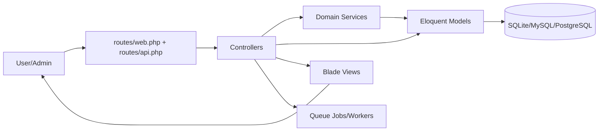

# Project Overview
Shoppy Max is a Laravel 12 operations platform for inventory, orders, reseller workflows,
courier settlements, and reporting, with Blade-based UIs and role-based access control.
Use this file as the primary execution map for setup, quality checks, architecture context,
and safe automation boundaries when making changes in this repository.

## Repository Structure
- `.github/`: GitHub workflow definitions for issue/PR/changelog automation.
- `app/`: Core Laravel application code (controllers, models, services, rules, providers).
- `bootstrap/`: Laravel bootstrap files and framework cache storage.
- `config/`: Application and package configuration, including Cloudinary and permissions.
- `database/`: Migrations, factories, and seeders for schema and demo/system data.
- `public/`: Web root, static entrypoint files, and built frontend assets.
- `resources/`: Blade templates and frontend source assets (`css/`, `js/`).
- `routes/`: HTTP, auth, API, and console route definitions.
- `server_utils/`: Server-side maintenance/debug utilities with elevated risk.
- `storage/`: Runtime storage for logs, cache, sessions, and compiled views.
- `tests/`: PHPUnit feature and unit tests.

## Build & Development Commands
```bash
# Install dependencies
composer install
npm install
```

```bash
# Project bootstrap helper (verbatim from composer scripts)
composer run setup
```

```bash
# Run in development
composer run dev
```

```bash
# Alternative manual dev processes
php artisan serve
php artisan queue:work
npm run dev
```

```bash
# Test
php artisan test
composer run test
```

```bash
# Lint/format
./vendor/bin/pint
```

# Type-check
> TODO: No dedicated static type-check command is currently documented.

```bash
# Build frontend assets
npm run build
```

```bash
# Debug/log inspection (from dev workflow)
php artisan pail --timeout=0
```

```bash
# Deploy/production optimization
php artisan config:cache
php artisan route:cache
php artisan view:cache
php artisan optimize
```

## Code Style & Conventions
- Follow existing Laravel conventions: PSR-4 autoloading and framework-standard structure.
- Use Laravel Pint (`./vendor/bin/pint`) for PHP formatting before submitting changes.
- Keep route/controller/service/model naming consistent with current domain-oriented names
  (for example `ResellerPayment`, `CourierPayment`, `StockService`).
- Prefer concise Blade + controller flows already used across `resources/views` and
  `app/Http/Controllers`.
- Commit message template:
  - > TODO: Define and document the required repository commit-message convention.

## Architecture Notes


Requests enter through Laravel routes, controllers coordinate business workflows, services
handle stock/inventory logic, and Eloquent models persist to the database. Blade templates
render admin/operational screens, while queue workers process asynchronous tasks such as
operational background jobs.

## Testing Strategy
1. Primary test runner is PHPUnit via `php artisan test` (or `composer run test`).
2. Existing test suites live in `tests/Feature` and `tests/Unit`.
3. Run tests locally before opening a PR:
   ```bash
   php artisan test
   ```
4. CI test workflow:
   - > TODO: No CI workflow running automated test jobs is currently documented in
     > `.github/workflows`.
5. Integration/e2e coverage:
   - > TODO: Define integration/e2e tooling and execution commands if required.

## Security & Compliance
- Never commit secrets; keep credentials in `.env` and rotate seeded default credentials in
  production as documented in `README.md`.
- Configure Cloudinary credentials before enabling image upload flows.
- Treat `server_utils/debug_login.php` and `server_utils/database_fresh_install.sql` as
  sensitive operational utilities; do not expose them publicly.
- Follow production hardening steps in `README.md` (set `APP_ENV=production`,
  `APP_DEBUG=false`, cache config/routes/views, and run managed queue workers).
- License: this repository is proprietary software; see `LICENSE`.
- Dependency/security scanning:
  - > TODO: Document mandatory dependency and SAST scanning commands/workflows.

## Agent Guardrails
1. Do not edit or commit secrets (`.env`, credential dumps, private keys).
2. Do not modify `server_utils/` utilities without explicit human approval.
3. Keep changes minimal and scoped; avoid unrelated refactors.
4. Run relevant tests/quality checks for touched areas before proposing changes.
5. Require human review for schema/migration changes and production-impacting config edits.
6. > TODO: Define explicit automation rate limits (API calls, retries, parallel jobs).

## Extensibility Hooks
- Environment variables in `.env` drive runtime behavior (database, queue, session, cache,
  Cloudinary, app URL/environment).
- Service layer extension points are under `app/Services` (for example stock/inventory units).
- Route-level extension points are `routes/web.php` and `routes/api.php`.
- Permissions/roles are managed via Spatie Permission and seeders in `database/seeders`.
- > TODO: Document feature flags if/when a formal flag system is introduced.

## Further Reading
- [README.md](README.md)
- [LICENSE](LICENSE)
- [server_utils/README.md](server_utils/README.md)
- [routes/web.php](routes/web.php)
- [routes/api.php](routes/api.php)
